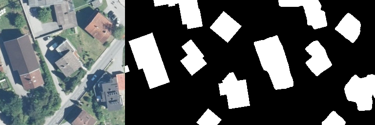

# hr-net-implementation
My Implementation of Deep High-Resolution Representation Learning for Visual Recognition on Cityscape data with HRnet

Dataset used - (https://www.cityscapes-dataset.com/)
Paper Link - HRNet (https://arxiv.org/pdf/1908.07919.pdf)

Achieved mIOU 65.22% (without pre-trained backbone)
